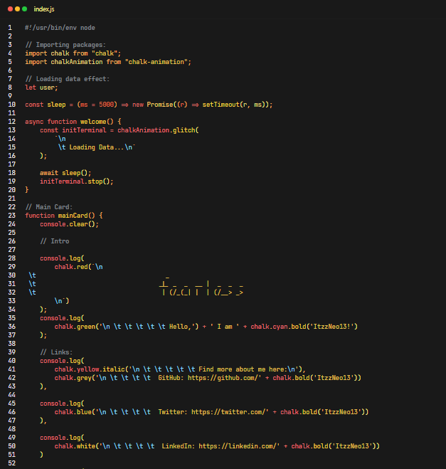

#### Minimal Theme!

This is a Minimal and Dark Theme for VS Code with warm color pallete for syntax highlighting & colored brackets to match the overall theme look and dark background colors so that it's easier to focus on the code.

-----

#### Preview - 

-----

#### Features -
1] Use of warm color palatte.

2] Suitable for use at night with low brightness.

3] Clean look.

4] Dark Background so it's comfortable to code for long durations.

-----

#### Theme Stats - 

-----

#### Troubleshooting & FAQ-

1] Theme is not loading in my VS Code client, how can I fix this?
- Restart VS Code
- Try reinstalling theme

2] I cannot see the theme in my extensions tab, what should i do? 
- Wait for a while. Sometimes extensions and themes take time to load. This can be because of various factors such as running background process on your PC/laptop, PC/Laptop Specs, etc.

3] Is any kind of paywall involved in the theme?
- No. No paywall such as premium or tiers are involved in Minimal Theme and is free to use for everyone.

4] Is this theme suitable for all devices?
- The theme is light in resource consumption and should probably run as expected on all devices.

5] How can I contribute to this project?

- Currently you can contribute to this project by submitting PR on [Github Repo](https://github.com/ItzzNeo13/Minimal-Theme) about -

  1. Reporting any improper syntax highlighting.

  2. Reporting unsupported languages.

  3. Any typos or mistakes in Markdown files.

-----

##### NOTE - Some text in Markdown and .txt files have white text colors and is not any kind of improper syntax highlighting

-----

If you face any problem while using this theme, make sure to let me know by reporting an issue or sending a mail on devneo13@gmail.com

Thanks for using my theme and have a great time ahead!! :D 

Regards,
ItzzNeo13,
Theme Designer.

----

----
